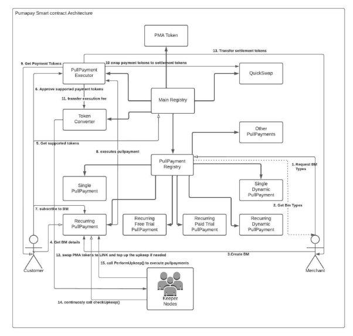

# General Smart Contract Architecture

## Introduction

The general smart contract architecture describes the components and their interaction in the pumaPay PullPayment system.

## Architecture

The following diagram indicates the general smart contract architecture of the PullPayment system.

## Components

The general smart contract architecture contains the following components:

1. Main Registry
2. PullPayment Registry
3. PullPayment contracts
4. Executor contract
5. PMA token
6. Swap contract
7. Customers
8. Merchants
9. Keeper Nodes

### Main Registry

#### Introduction

The main Registry contract is the central contract which keeps record of all the contracts in the PullPayment system.

#### Interface methods

The main registry contains the following interface methods that allows users to interact with the registry:

1. setAddressFor():
1. getAddressForOrDie()
1. getAddressForStringOrDie()
1. getAddressForString()
1. isOneOf()
1. addToken()
1. removeToken()
1. updateExecutionFee()
1. updateExtensionPeriod()
1. getSupportedTokens()
1. isSupportedToken()

### PullPayment Registry

#### Introduction

The PullPayment contract is the central contract for the PullPayments which keeps record of all the PullPayment contracts in the system. Users can get the address of any PullPayment contract using this contract. It also stores the low balance subscription ids and the upkeep ids.

#### Interface methods

The PullPayment Registry contains the following methods that allows users to interact with the registry:

1. grantExecutor()
1. revokeExecutor()
1. addPullPaymentContract()
1. getPPAddressForOrDie()
1. getPPAddressFor()
1. getPPAddressForStringOrDie()
1. getPPAddressForString()
1. isExecutorGranted()
1. addLowBalanceSubscription()
1. removeLowBalanceSubscription()
1. setUpkeepId()

### PullPayment Contracts

#### Introduction

The PullPayment contracts allow the creation and subscription of different types of the billing models.

**PullPayment contract types:**

1. Recurring PullPayment
1. Recurring Free Trial PullPayment
1. Recurring Paid Trial PullPayment
1. Recurring Dynamic PullPayment
1. Single PullPayment
1. Single Dynamic PullPayment

#### General PullPayment methods:

1. createBillingModel()
1. subscribeToBillingModel()
1. executePullPayment()
1. cancelSubscription()
1. editBillingModel()
1. getBillingModel()
1. getSubscription()
1. getPullPayment()
1. getBillingModel()
1. getBillingModelIdsByAddress()
1. getSubscriptionIdsByAddress()
1. getCanceledSubscriptionIdsByAddress()
1. getPullPaymentIdsByAddress()
1. checkUpkeep()
1. performUpkeep()
1. getSubscriptionIds()
1. isPullPayment()

### Executor Contract

#### Introduction

- The Executor contract allows executors/PullPayment contracts to execute the PullPayments for any subscription Ids.
- It gets the tokens from the customer, swaps the tokens and then transfers the tokens to the merchant.
- It uses the quick swap to swap the tokens.

#### Interface methods

The executor contracts contain following methods which allows executors to execute the PullPayments.

1. execute()- any user can call this.
1. execute()- Only the user with the executor role can call this.
1. canSwapFromV2()
1. getReceivingAmount()

### PMA Token

#### Introduction

The PMA token is an ERC20 contract. This contract contains the Default admin, minter and pauser roles.

#### Interface methods

The PMA token contains all the ERC20 methods. Also it contains the-

1. mint()
1. burn()
1. pause()
1. unpause()

### Supported Tokens

#### Introduction

The Supported token contract holds the whitelist of ERC20 tokens that can be used for PullPayments.

#### Interface Methods
- addToken()
- getSupported()

### Swap contract

#### Introduction

The swap contract uses the pancake swap to swap the tokens. The tokens can be swapped for the following cases:

- Non-PMA -> PMA
- PMA -> Non-PMA
- Non-PMA -> Non-PMA

### Customers:

- Customers are the end users of the PullPayment system who subscribes to the particular billing model for the payment.
- Customers interact with the PullPayment registry to request the billing model types and then subscribe to the particular billing model.
- Customers should approve the payment tokens to the Executor contract before subscription.

### Merchants:

- The Merchants are the end users of the PullPayment system who creates the billing model for their business.
- Merchants interact with the PullPayment registry to request the billing model types and then create the billing model according to business needs.

### Keeper Nodes:

- The ChainLink Keeper nodes are responsible for automating the PullPayment execution.
- Keeper nodes continuously call checkUpkeep() method of the upkeep contracts at each block.
- If checkUpkeep() method returns the true boolean value then keeper node calls the performUpkeep() method of the upkeep to execute the batch of PullPayments for subscriptions.

## Flow of execution

- Before end users start interacting with the system, the system architecture should be in place.
- For that, first we register all the contracts of the system i.e PullPayment Registry, Executor, Swap Contract, PMA token, Supported Tokens etc. in the main Registry.
- Then we register all the PullPayment contracts on the PullPayment Registry.

- Once all the smart contracts are in the place, following flow is followed by the PullPayment system-

1. The merchant makes a request to the PullPayment Registry contract for the billing model types.
1. Merchant gets the list of available billing model types.
1. Merchant selects the particular billing model and creates the billing model according to business needs.
1. Merchant receives the billing model id after creating the billing model.
1. Subscriber makes a request to the PullPayment registry contract for the billing model types.
1. Subscriber gets the list of available billing models.
1. Subscriber should approve unlimited tokens to the Executor contract before subscription.
1. Subscriber selects a particular billing model according to needs and subscribes to it.
1. After subscription Subscriber receives the subscription id.
1. The Executors execute the PullPayment for particular subscriptions using the Executor contract.
1. The Executor contract gets the required amount of tokens from the customer, swap the tokens using swap contract and then transfers the tokens to the merchant.